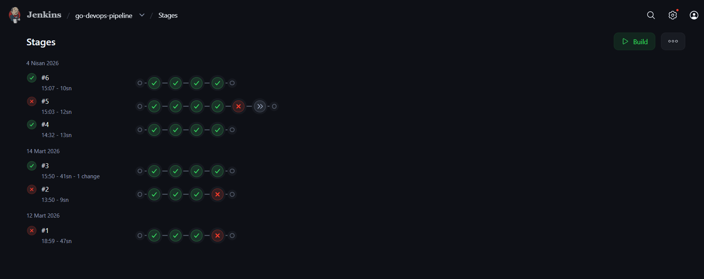
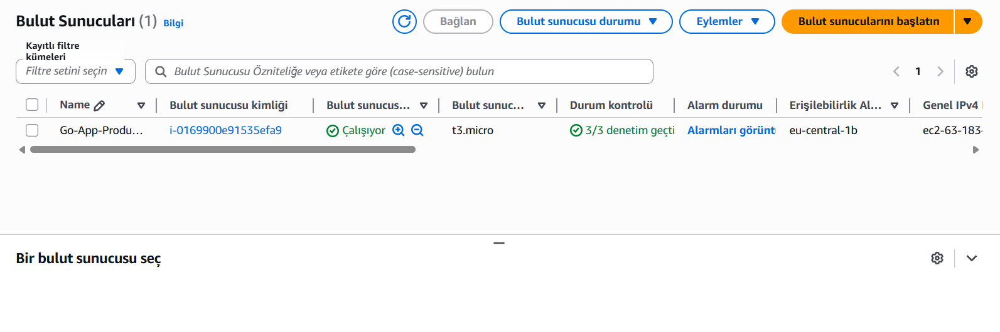
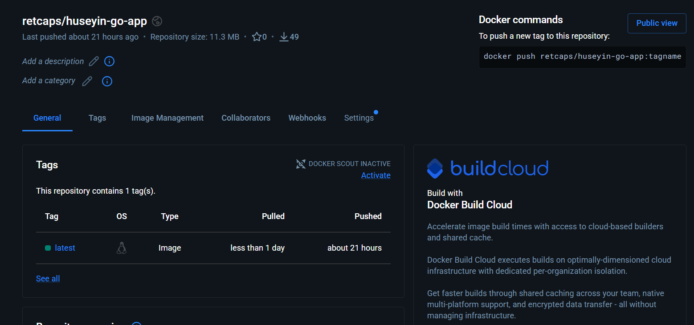
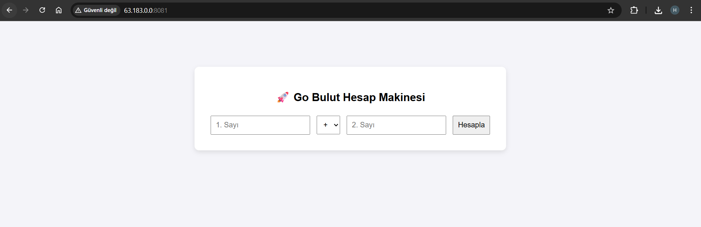

# 🚀 Uçtan Uca DevOps CI/CD Pipeline & Go Web Uygulaması

Bu proje, Go (Golang) ile geliştirilmiş web tabanlı bir hesap makinesinin sıfırdan AWS bulut ortamına tam otomatik bir şekilde taşınmasını sağlayan **Uçtan Uca (End-to-End) CI/CD Pipeline** mimarisidir. 

Projenin amacı; yazılan kodun donanımdan bağımsız çalışabilmesini (Docker), altyapının kodla yönetilmesini (Terraform) ve dağıtım süreçlerinin insan eli değmeden otomatize edilmesini (Jenkins & Ansible) sağlamaktır.

## 🛠 Kullanılan Teknolojiler

* **Backend:** Go (Golang)
* **Konteyner Mimari:** Docker & Docker Hub
* **CI/CD Otomasyonu:** Jenkins (Pipeline-as-Code)
* **IaC (Altyapı Kodlama):** Terraform
* **Konfigürasyon Yönetimi:** Ansible
* **Bulut Sağlayıcı:** AWS (EC2 & Security Groups)

---

## 🏗 Sistem Mimarisi ve Pipeline Akışı

1. **Geliştirme:** Go ile geliştirilen web uygulaması GitHub'a itilir.
2. **Sürekli Entegrasyon (CI - Jenkins):** * Jenkins kodu GitHub'dan çeker.
   * `Dockerfile` kullanılarak uygulama konteynerize edilir.
   * Oluşturulan imaj, Jenkins üzerinden güvenli bir şekilde **Docker Hub'a** (`retcaps/huseyin-go-app:latest`) itilir.
3. **Altyapı Hazırlığı (IaC - Terraform):** AWS üzerinde projenin çalışacağı EC2 sunucusu ve 8081 portuna izin veren güvenlik grupları Terraform ile ayağa kaldırılır.
4. **Sürekli Dağıtım (CD - Ansible):** Ansible, hedef AWS sunucusuna bağlanır ve Docker Hub'daki en güncel imajı çekerek canlı ortama alır.

---

## 📸 Projeden Görüntüler

### ⚙️ Jenkins CI Pipeline Aşamaları
Jenkins'in kodu çekme, test etme, Docker imajı oluşturma ve Docker Hub'a gönderme aşamalarının (Pipeline) başarıyla tamamlandığı ekran.



### ☁️ AWS Altyapısı ve Sunucu Detayları
Terraform tarafından otomatik olarak oluşturulan AWS EC2 bulut sunucumuz.




### 🐳 Docker Hub İmaj Deposu
Jenkins tarafından otomatik olarak derlenip buluta fırlatılan uygulamanın en güncel Docker imajı.




### 🚀 Canlı Web Uygulaması
Pipeline'ın son adımı olarak AWS sunucumuzda `8081` portunda ayağa kalkan web tabanlı Go uygulamamız.



---

## 💻 Kurulum ve Çalıştırma

Projeyi kendi ortamınızda test etmek isterseniz aşağıdaki adımları izleyebilirsiniz:

**1. AWS Altyapısını Kurma (Terraform)**
```bash
cd devops-terraform
terraform init
terraform apply -auto-approve
```
## 🎯 Projenin Amacı

Geliştirilen bir yazılımın sadece "yerel bilgisayarda çalışması", modern bilgisayar mühendisliği standartları için yeterli değildir. Bu projenin temel amacı; teorik yazılım geliştirme süreçlerini, endüstri standardı DevOps pratikleriyle birleştirerek tam otomatik bir üretim hattı kurmaktır. 

Manuel müdahaleleri, insan kaynaklı hataları ve "benim makinemde çalışıyordu" problemini tamamen ortadan kaldırarak; kodun yazılmasından bulut ortamında canlıya alınmasına kadar geçen tüm yazılım yaşam döngüsünü (SDLC) güvenilir, tekrarlanabilir ve kodla yönetilebilir (IaC) bir mimariye oturtmak hedeflenmiştir.

---

## 📖 Genel Özet

Bu proje, Go (Golang) ile geliştirilmiş web tabanlı bir uygulamanın, AWS bulut ortamına sıfır manuel müdahale ile dağıtılmasını sağlayan uçtan uca bir **CI/CD (Sürekli Entegrasyon ve Sürekli Dağıtım)** hattıdır.

Sistem şu şekilde işler:
1.  **Geliştirme & Versiyon Kontrolü:** Yazılan Go kodu GitHub deposuna aktarılır.
2.  **Sürekli Entegrasyon (CI):** Jenkins, güncel kodu çeker, bağımlılıkları yükler, uygulamayı Docker ile konteynerize eder ve oluşturduğu bu yeni imajı güvenli bir şekilde Docker Hub'a (Image Registry) yükler.
3.  **Altyapı Otomasyonu (IaC):** Terraform, uygulamanın üzerinde koşacağı AWS EC2 sunucusunu ve ağ güvenlik kurallarını (Security Groups) kod ile saniyeler içinde inşa eder.
4.  **Sürekli Dağıtım (CD):** Ansible, Terraform'un ayağa kaldırdığı bu bulut sunucusuna SSH ile bağlanır, ortamı hazırlar ve Docker Hub'daki en güncel imajı çekerek uygulamayı erişime açar.

Sonuç olarak; kod gönderildiği an çalışan, altyapısı kodla yönetilen ve her ortamda aynı performansı veren modern bir bulut mimarisi elde edilmiştir.
